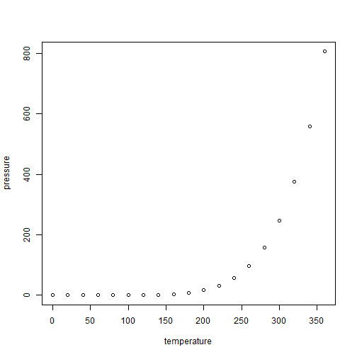

## R Markdown

This is an R Markdown document. Markdown is a simple formatting syntax for authoring HTML, PDF, and MS Word documents. For more details on using R Markdown see <http://rmarkdown.rstudio.com>.

When you click the **Knit** button a document will be generated that includes both content as well as the output of any embedded R code chunks within the document. You can embed an R code chunk like this:


```r
summary(cars)
```

```
##      speed           dist           residual         predicted     
##  Min.   : 4.0   Min.   :  2.00   Min.   :-29.069   Min.   :-1.849  
##  1st Qu.:12.0   1st Qu.: 26.00   1st Qu.: -9.525   1st Qu.:29.610  
##  Median :15.0   Median : 36.00   Median : -2.272   Median :41.407  
##  Mean   :15.4   Mean   : 42.98   Mean   :  0.000   Mean   :42.980  
##  3rd Qu.:19.0   3rd Qu.: 56.00   3rd Qu.:  9.215   3rd Qu.:57.137  
##  Max.   :25.0   Max.   :120.00   Max.   : 43.201   Max.   :80.731
```

## Including Plots

You can also embed plots, for example:



Note that the `echo = FALSE` parameter was added to the code chunk to prevent printing of the R code that generated the plot.
